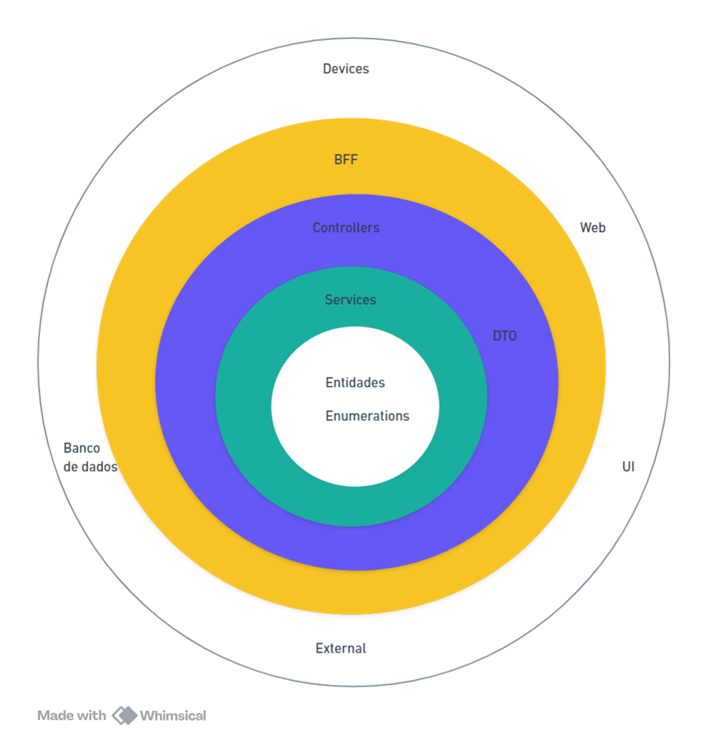

# Projeto Vinho Notas App

Este é o repositório do projeto `vinho-notas-app`, uma aplicação para facilitar a experiência de degustar vinhos, favorecendo a expansão e a descoberta de conhecimento de maneira organizada e estruturada.

## Tecnologias Utilizadas

- Java
- Maven
- PostgreSQL
- JavaScript
- NPM
- React
- Vite
- PrimeReact
- Axios
- Spring Boot
- JPA
- Hibernate
- Lombok
- JUnit
- Mockito
- Docker
- Docker Compose
- GitHub Actions
- Swagger

## Configuração do Projeto

### Pré-requisitos

- Java 17 ou superior
- Node.js e NPM
- Um servidor SQL

### Configuração

1. Clone o repositório para o seu ambiente local.
2. Navegue até a pasta do projeto e execute `mvn install` para instalar as dependências do Maven.
3. Execute `npm install` para instalar as dependências do Node.js.
4. Configure o seu servidor SQL com as credenciais corretas.
5. Execute o script SQL fornecido para criar o banco de dados e as tabelas necessárias.

## Execução do Projeto

Para executar o projeto, siga os passos abaixo:

1. Inicie o servidor SQL.
2. Execute `mvn spring-boot:run` para iniciar o servidor backend.
3. Em uma nova janela do terminal, navegue até a pasta do projeto de frontend e execute `npm start` para iniciar o servidor frontend.

Agora você deve ser capaz de acessar a aplicação em `http://localhost:5173`.

### Arquitetura do projeto

O projeto é dividido em duas partes principais: o backend e o frontend. O backend é construído com Spring Boot e o frontend é construído com React + Vite.

Em termos arquiteturais, o projeto segue o padrão MVC (Model-View-Controller) no backend e o padrão de componentes no frontend.

## Licença

Este projeto está licenciado sob a licença MIT. Veja o arquivo `LICENSE` para mais detalhes.