# Projeto Vinho Notas App

Este é o repositório do projeto `vinho-notas-app`, uma aplicação para facilitar a experiência de degustar vinhos, favorecendo a expansão e a descoberta de conhecimento de maneira organizada e estruturada.

## Tecnologias Utilizadas

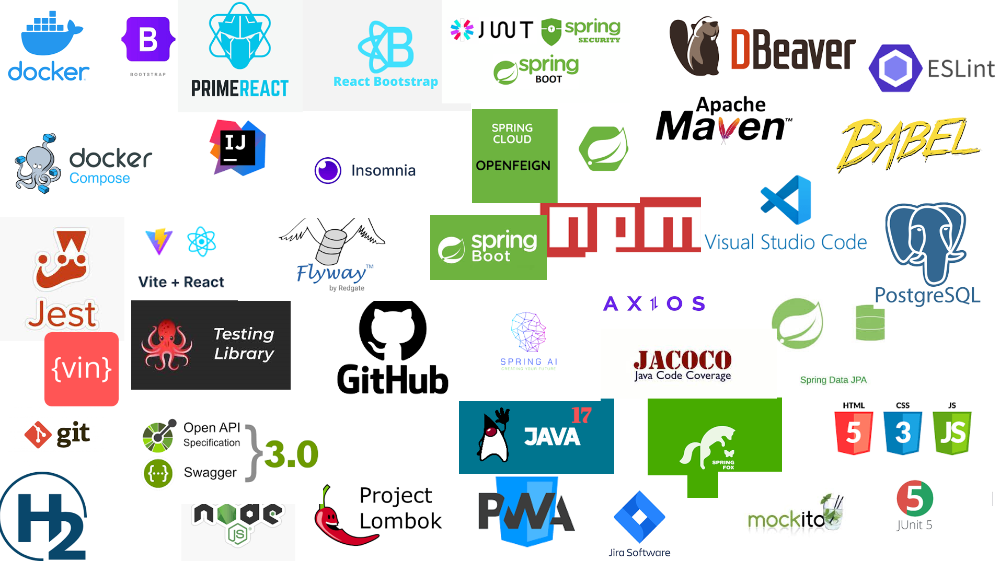

## Índice

## Introdução

O vinho, uma bebida milenar apreciada por sua complexa combinação de sabores e aromas, conquista cada vez mais adeptos no Brasil. No entanto, para muitos, esse universo ainda é cercado de mistérios e desafios. Em uma definição fria, pode-se dizer que é uma bebida alcoólica obtida a partir da fermentação de uvas. Mas para quem a aprecia, vai muito além de uma simples definição. Pensando do ponto de vista de um enófilo, ela é uma mistura de sabores, aromas e texturas que permite uma verdadeira viagem em cada taça. Degustar é como atravessar o tempo e o espaço, entre a essência de uma safra e uma experiência sensorial única.

É justamente para ajudar o apreciador de vinho amador ou ainda aquele que deseja entrar nesse mundo que se propôs a criação do Vinho Notas. Em outras palavras, para o enófilo amador que tem dificuldade em compreender os métodos e técnicas de degustação devido às complexidades envolvidas, o Vinho Notas é uma aplicação de desktop progressiva (PWA). Ele facilita a experiência de degustar e, diferentemente dos websites e aplicativos de compras, essa solução melhora a experiência na jornada de descobertas no mundo dos vinhos, ajudando a organizar e registrar as degustações, permitindo recuperar o histórico e sugerindo opções para compras futuras.

Para construir o Vinho Notas optou-se pela metodologia ágil por ser uma abordagem ampla e flexível, com foco em valores e princípios, adotando o Scrum como framework para o desenvolvimento do projeto. Dentro dessa metodologia, optou-se por Sprints curtas, de no máximo uma semana, com meta bem definida trabalhando-se com pequenas tarefas, dando maior celeridade ao desenvolvimento do software.

Para ajudar a organizar o trabalho de desenvolvimento, optou-se pelo Jira Software da <a href='https://www.atlassian.com/software/jira' target="_blank">Atlassian</a>. Com ele foi possível organizar e construir um quadro usando o Scrum como referência, e com isso ter uma visão mais abrangente do andamento das coisas.

A figura abaixo apresenta o Business Model Canvas da solução, obtida a partir do template fornecido pelo <a href='https://www.strategyzer.com/library/the-business-model-canvas' target="_blank">Strategyzer</a>.

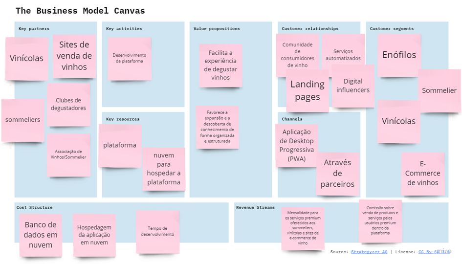

## Funcionalidades

A solução toda foi pensada para ser agnóstica, ou seja, independente de qualquer plataforma ou tecnologia específica. Em outras palavras, ela não está vinculada a um sistema operacional, linguagem de programação ou ambiente de desenvolvimento específico.

Para conseguir isso, optou-se pela construção de APIs (Interfaces de Programação de Aplicativos) permitindo que diferentes sistemas se comuniquem entre si de forma padronizada, independentemente das tecnologias subjacentes. Dessa forma consegui-se garantir que ela possa ser facilmente integrada a uma variedade de plataformas, sistemas e linguagens de programação, tornando-a mais agnóstica em relação às tecnologias específicas.

Para dao ao usuário a experiência similar à uma aplicação desktop, optou-se pela criação de uma SPA (Single Page Application). Além disso, para garantir uma experiência ainda melhor, buscou-se a combinação da SPA com uma PWA (Progressive Web Application), permitindo assim que o Vinho Notas seja instalado tanto no computador quanto no celular do usuário.

Com isso, consegui-se combinar a eficiência e a experiência do usuário de uma SPA com as vantagens adicionais de uma PWA, como capacidades offline, instalação na tela inicial e atualizações automáticas, resultando em uma experiência de usuário mais atraente e resiliente.

## Configuração do Projeto

### Pré-requisitos

- Java 17
- Node.js e NPM
- Docker

### Configuração

1. Clone o repositório para o seu ambiente local utilizando o comando git abaixo:
``git clone https://github.com/vinho-notas/vinho-notas-app.git``
2. Navegue até a pasta de cada um dos microsserviços e execute ``mvn install` para instalar as dependências do Maven.
3. Na pasta do frontend, execute `npm install` para instalar as dependências do Node.js.

## Execução do Projeto

### Executando cada microsserviço individualmente
Para executar o projeto, siga os passos abaixo:

1. Navegue até a pasta raiz do projeto e execute o comando ``docker compose up -d`` em um terminal, certificand-se de estar com o Docker ligado. Esse comando inicia o banco de dados PostgreSQL relacionado a cada microsserviço.

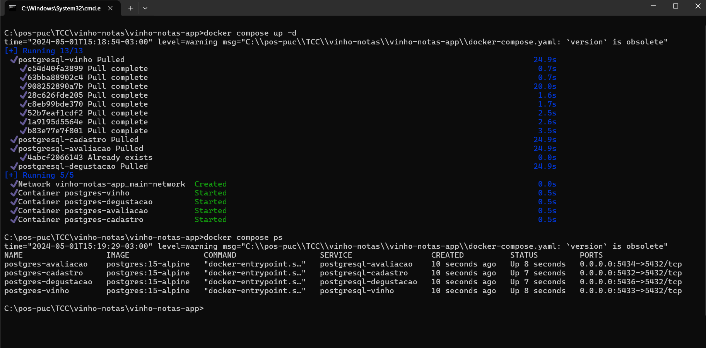

2. Execute `mvn spring-boot:run` para iniciar o servidor backend de cada microsserviço.
3. Em uma nova janela do terminal, navegue até a pasta do projeto de frontend e execute `npm run dev` para iniciar o servidor frontend.
4. Agora você deve ser capaz de acessar a aplicação em <a href='http://localhost:5173' target="_blank"> `http://localhost:5173`</a>, que deve se apresentar com a seguinte aparência:

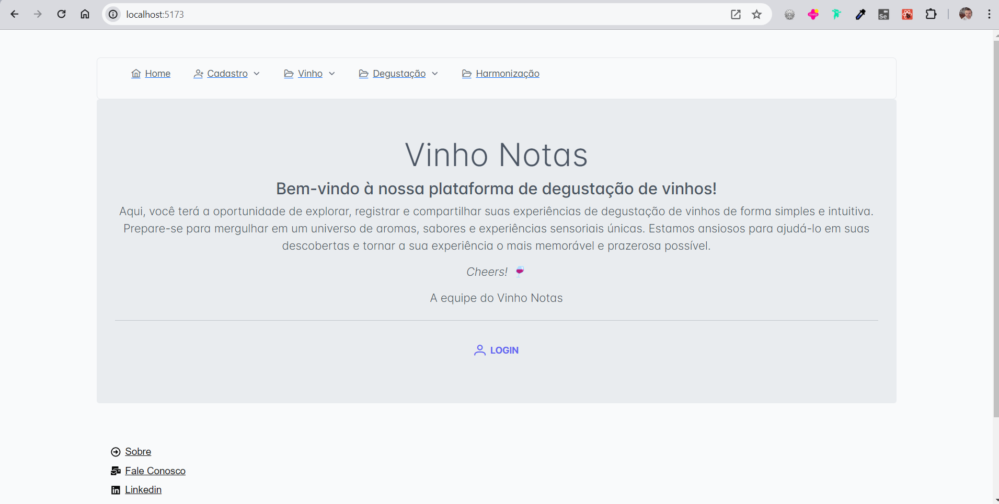

### Executando o projeto como um todo a partir de uma imagem Docker

Alternativamente é possível iniciar os serviços de forma automática utilizando as imagens dos serviços disponíveis no <a href='https://hub.docker.com/' target="_blank">DockerHub</a> 

1. Navegue até a pasta raiz do projeto e abra o arquivo <a href='./docker-compose.yaml'>docker-compose.yaml</a>.
2. Remova os comentários das linhas 67 em diante, salve o arquivo e execute o comando ``docker compose up -d`` em um terminal, certificand-se de estar com o Docker ligado. 

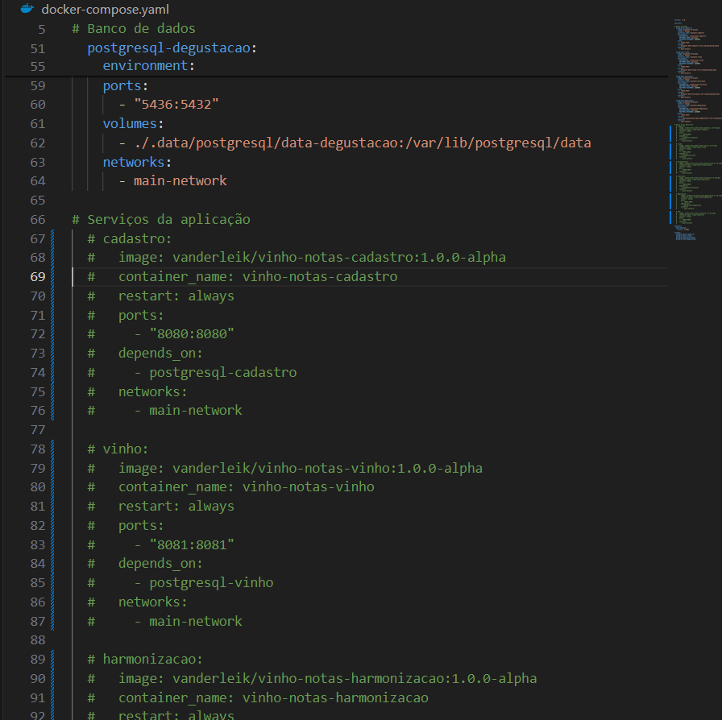

Ao proceder dessa forma o docker-compose.yaml se encarregará de baixar as imagens de cada microsserviço no Docker Hub e dessa forma iniciará o banco de dados PostgreSQL relacionado a cada serviço mais os back ends.

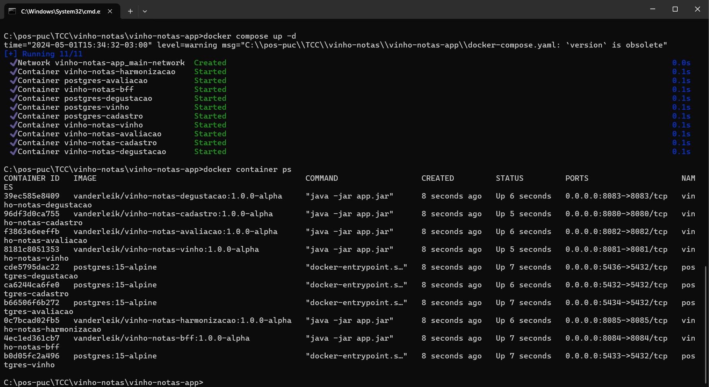

3. Agora você deve ser capaz de acessar a aplicação em <a href='http://localhost:5173' target="_blank"> `http://localhost:5173`</a>, que deve se apresentar com a seguinte aparência:

## Navegando pela solução

### Tela inicial e cadastro

A tela inicial convida o usuário a realizar o login a fim de permitir que ele possa utilizar o sistema. Caso ele ainda não tenha usuário e senha, é convidado a se registrar, coforme figura abaixo:

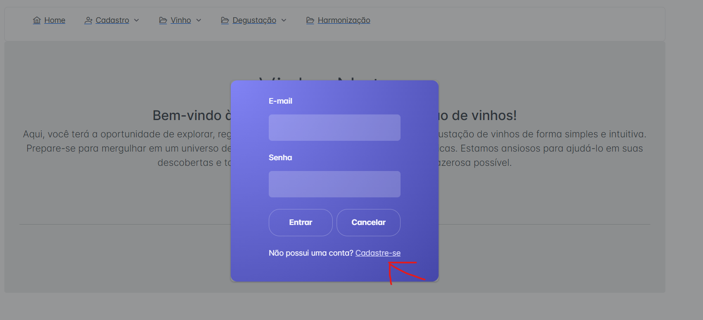

As validações de usuário e senha que permitem a utilização do sistema estão desabilitados para possibilitar a utilização do sistema sem a necessidade de informar dados pessoais na aplicação, que serão salvos em um banco de dados.

No entanto, caso queira realizar um cadastro para ver como funciona, o sistema está habilitado para aceitar os seguintes CPFs:

"00000000000", "11111111111", "22222222222", "33333333333", "44444444444", "55555555555", "66666666666", "77777777777", "88888888888", "99999999999".

Quailquer número de CPF que não esteja na listagem acima terá o cadastro rejeitado.

### Menu Vinho

O menu Vinho é composto por dois submenus: Vinhos e Avaliações.

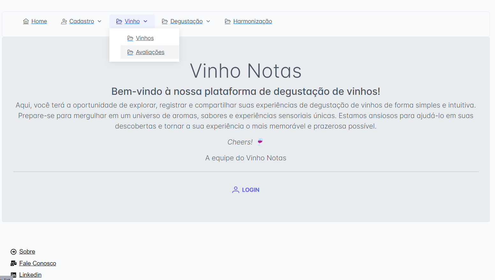

A tela com a listagem dos vinhos possui as seguintes características:

<ol>
<li>Componente toolbar: agrupa os botões responsáveis por cadastrar um vinho novo, editar um dos vinhos listados na tela, excluir um dos vinhos ou avaliar um vinho.</li>
<li>Componente multiselect: através desse componente é possível personalizar as colunas que serão exibidas na tela.</li>
<li>Componente de pesquisa: a pesquisa pode ser feita por palavra chave e o sistema está apto a filtrar um vinho de acordo com o critério informado no campo. Não é necessário colocar uma palavra exata, a partir de uma letra o sistema inicia o filtro buscando em toda a tabela a resposta correspondente.</li>
<li>Componente de exportação: os dados listados na tela podem ser exportados para um arquivo .csv permitindo ao usuário transportar essas informações para onde ele quiser.</li>
<li>Componente de ordenação: é possível ordenar os registros de acordo com cada coluna da tabela, tanto em ordem ascendente quanto descendente.</li>
<li>Componente checkbox: permite selecionar um registro ou mais registros. Necessário para editar ou excluir um ou mais vinhos.</li>
</ol>

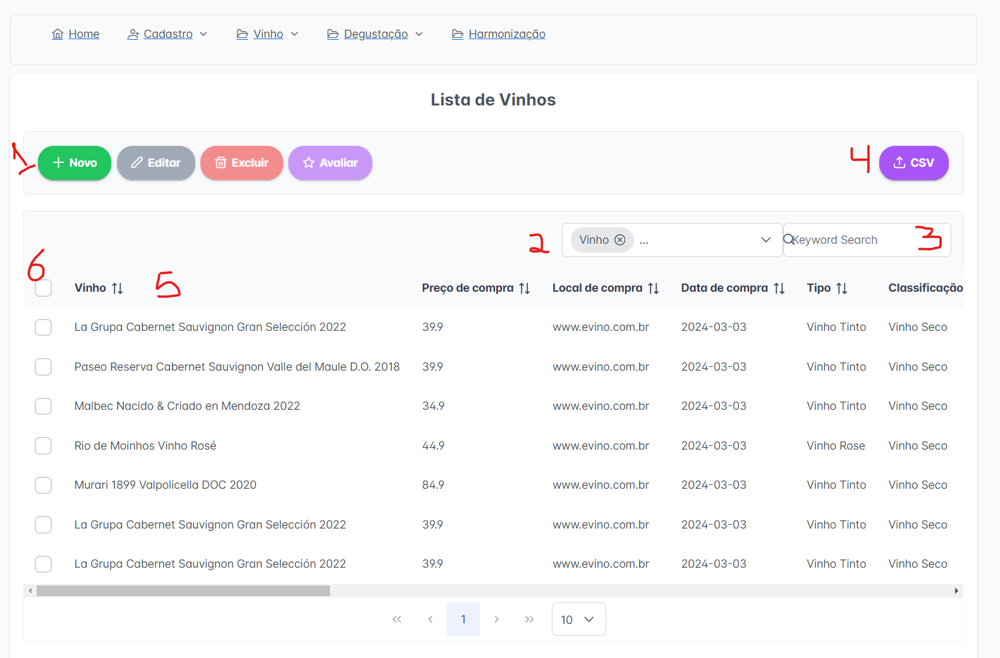

A avaliação do vinho é feita a partir da seleção de um vinho, clicando no botão "Avaliar". O menu "Avaliações" lista todas as avaliações registradas no sistema.

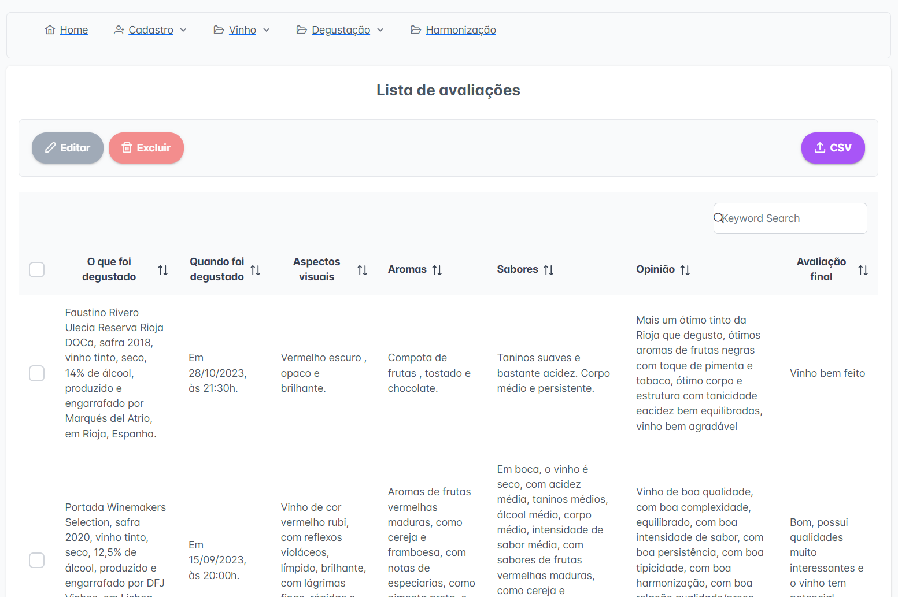

### Menu Degustação

O menu degustação apresenta as fichas de degustação cadastradas pelo usuário. Diferentemente do submenu "Avaliação", a degustação é algo mais elaborado, seguindo regras, conduzindo o usuário à uma degustação mais profissional, preenchendo literalmente uma ficha de degustação de vinhos.

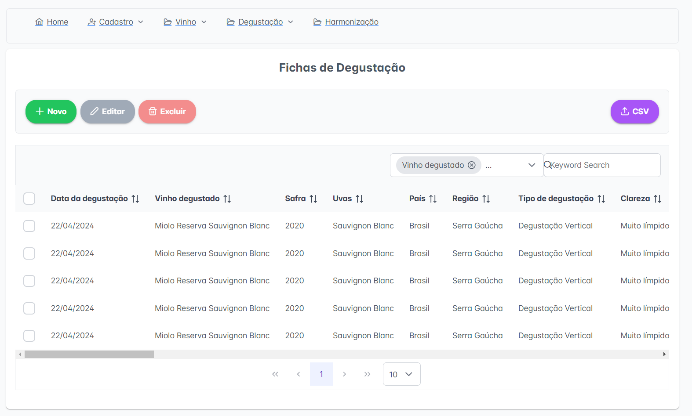

### Menu Harmonização

O ponto alto da solução está no menu Harmonização. Ao abrir a tela é apresentado ao usuário um campo onde ele informa o nome de um vinho e pode escolher uma entre três opções: 
<ol>
<li>Informações sobre o vinho;</li>
<li>Sugestão de harmonização;</li>
<li>Sugestão de menu.</li>
</ol>

O serviço responsável pela execução dessa tela foi concebido para utilizar uma Inteligência Artificial (IA) Generativa, baseada no GPT da OpenAi. Ao informar o vinho, essa IA buscará as informações e fará as recomendações conforme solicitado pelo usuário.

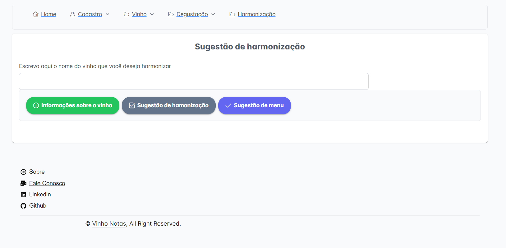

Para que isso seja possível é necessária a criação de uma APIKEY no site da <a href='https://platform.openai.com/api-keys' target="_blank">OpenAi</a>.

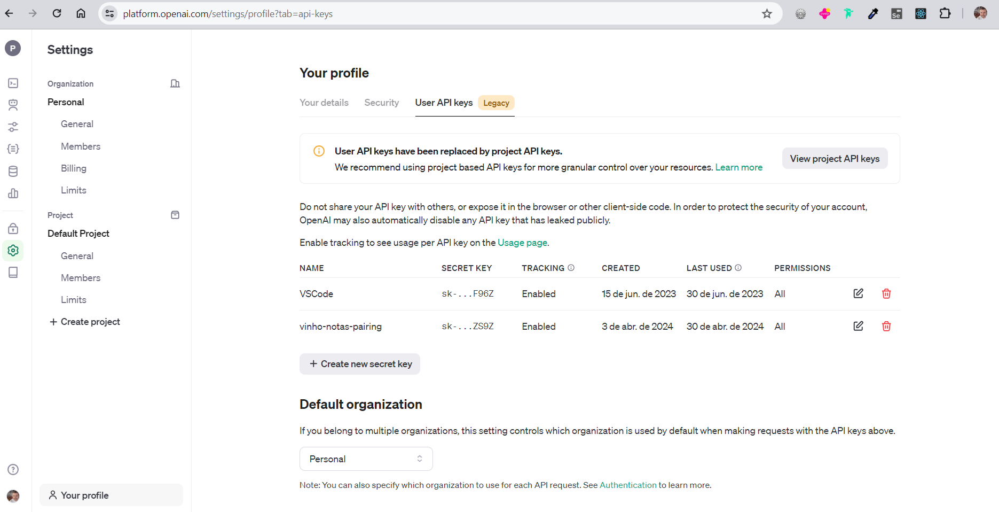

### Instalando o Vinho Notas localmente

O fato do Vinho Notas ter sido construído como uma PWA permite que o usuário instale a solução em seu computador pessoal ou no celular. Para isso basta clicar no ícone que aparece no canto superior direito da barra de endereços do navagador:

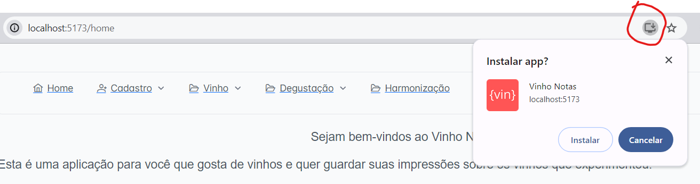

O resultado final é uma aplicação limpa e visualmente agradável ao usuário:

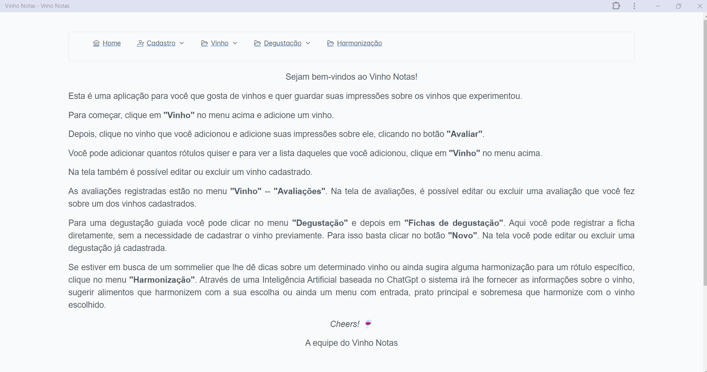

### Swagger

Após subir a aplicação você pode acessar o Swagger das APIs nos seguintes endereços:

<ul>
<li>Cadastro: <a href='http://localhost:8080/swagger-ui/index.html' target="_blank">http://localhost:8080/swagger-ui/index.html</a></li>
<li>Vinho: <a href='http://localhost:8081/swagger-ui/index.html' target="_blank">http://localhost:8081/swagger-ui/index.html</a></li>
<li>Avaliação de Vinhos: <a href='http://localhost:8082/swagger-ui/index.html' target="_blank">http://localhost:8082/swagger-ui/index.html</a></li>
<li>Degustação de Vinhos: <a href='http://localhost:8083/swagger-ui/index.html' target="_blank">http://localhost:8083/swagger-ui/index.html</a></li>
<li>BFF: <a href='http://localhost:8084/swagger-ui/index.html' target="_blank">http://localhost:8084/swagger-ui/index.html</a></li>

</ul>

### Arquitetura do projeto

O projeto é dividido em duas partes principais: o backend e o frontend. O backend é construído com Spring Boot e o frontend é construído com React + Vite.

Em termos arquiteturais, o projeto segue o padrão MVC (Model-View-Controller) no backend e o padrão de componentes no frontend.

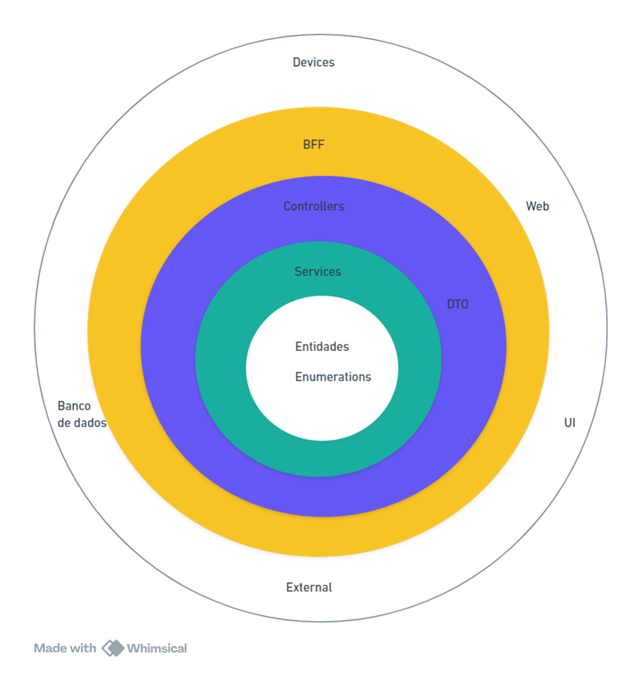

## Licença

Este projeto está licenciado sob a licença MIT. Veja o arquivo `LICENSE` para mais detalhes.

## Contato

Para contato utilize um dos canais abaixo:

<ul>
<li><a href='https://www.linkedin.com/in/vanderlei-kleinschmidt-a1557731/' target="_blank">Linkedin</a></li>
<li><a href='mailto:vanderleik@yahoo.com.br' target="_blank">vanderleik@yahoo.com.br</a></li>
<li><a href='https://github.com/vanderleik' target="_blank">github.com/vanderleik</a></li>
</ul>